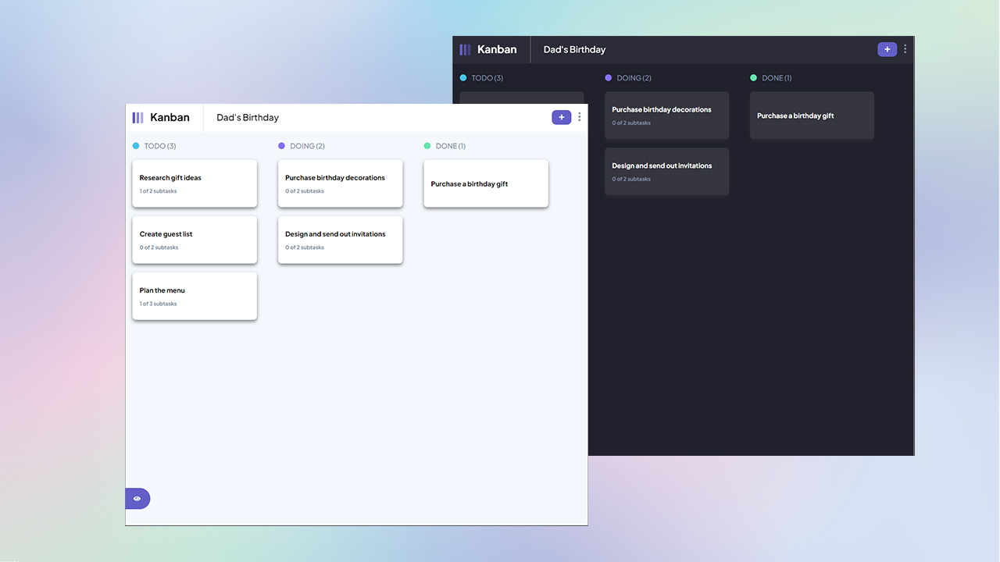

# Kanban - Task Management App



## Table of contents

- [Overview](#overview)
  - [The Kanban Project](#the-kanban-project)
  - [Screenshots](#screenshots)
  - [Links](#links)
- [My process](#my-process)
  - [Built with](#built-with)
  - [Technologies](#technologies)
- [Author](#author)

## Overview

### The Kanban Project

Hi there, thank you for you checking out this project ❤️

I created this app in order to display a little bit more of my full stack development knowledge. The idea is pretty straightfoward: This is a task management app (similar to Trello and Jira), where you can create many boards, in which you can track the status of all those board's related tasks in multiple status columns. All the boards, columns, tasks and subtasks are completely customizable and you can even drag and drop thoses tasks to any column you wish.

### Functional Requirements for the Kanban App:

1. **Task Management:**
   - Users should be able to mark subtasks as complete and move tasks between the columns to reflect their progress.

2. **Responsive Layout:**
   - The app should adapt its layout based on the user's device screen size to provide an optimal viewing experience.

3. **CRUD Operations:**
   - Users should be able to perform Create, Read, Update, and Delete operations for both boards and tasks within the app.

4. **Form Validations:**
   - When creating or editing boards and tasks, the app should validate user input to ensure data integrity and provide appropriate error messages for any invalid submissions.

5. **Hover States:**
   - Interactive elements on the page, such as buttons and links, should exhibit visual feedback when hovered over by the user.

6. **Sidebar Toggle:**
   - The app should provide functionality to hide or show the board sidebar, allowing users to focus on the main content area when needed.

7. **Theme Toggle:**
   - Users should have the ability to switch between light and dark themes to customize the app's appearance according to their preference.

8. **Drag and Drop Functionality:**
   - Users should be able to drag and drop tasks to change their status (column) and re-order them within a column, providing an intuitive and flexible user experience.

9. **Persistent Data:**
   - To ensure data persistence, the app should keep track of any changes made by the user, even after refreshing the browser

10. **Full-Stack Implementation:**
    - The project should be developed as a full-stack application, leveraging both front-end and back-end technologies to handle data storage, retrieval, and manipulation.


### Screenshots


### Links

- Back End Repo: [kanban-api](https://github.com/oniasfilho/kanban-api)
<!-- - Live Site URL: [soon](#) -->

## My process

### Technologies

- HTML5, CSS3 and SASS
- Flexbox
- CSS Grid
- Java
- Spring Boot
- MongoDB
- Mobile-first workflow
- [React](https://reactjs.org/)


<!-- ```html
<h1>Some HTML code I'm proud of</h1>
```
```css
.proud-of-this-css {
  color: papayawhip;
}
```
```js
const proudOfThisFunc = () => {
  console.log('🎉')
}
``` -->

## Author

<!-- - Website - [Add my website later ](https://www.oniasfilho.io) -->
- LinkedIn - [@oniasfilho](https://www.linkedin.com/in/oniasfilho/)
